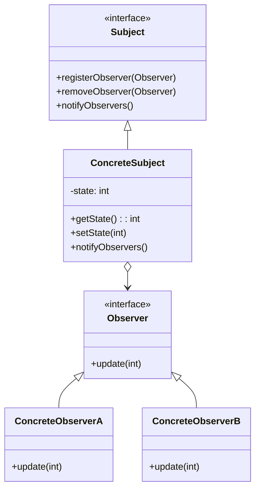

# 什么是观察者模式？一般用在什么场景？

**难度**：简单

**创建时间**：2025-10-06 05:56:28

## 答案
**观察者模式（Observer Pattern）** 是一种行为设计模式，它定义了一种**一对多**的依赖关系，当一个对象（主题/Subject）的状态发生改变时，所有依赖它的对象（观察者/Observer）都会自动收到通知并更新。这种模式也被称为**发布-订阅模式（Publish-Subscribe Pattern）**，核心思想是**解耦主题与观察者**，使它们可以独立变化。

---

### **一、观察者模式的结构**
观察者模式通常包含以下角色：
1. **主题（Subject）**：  
   - 维护一个观察者列表，提供添加、删除和通知观察者的方法。  
   - 当状态变化时，主动通知所有注册的观察者。  
2. **观察者（Observer）**：  
   - 定义一个更新接口（如`update()`方法），主题状态变化时会被调用。  
3. **具体主题（Concrete Subject）**：  
   - 继承或实现主题接口，存储具体状态，并在状态变化时触发通知。  
4. **具体观察者（Concrete Observer）**：  
   - 实现观察者接口，在收到通知时执行具体逻辑（如更新UI、记录日志等）。

#### **类图示例**


---

### **二、观察者模式的核心优势**
1. **解耦主题与观察者**  
   - 主题无需知道观察者的具体实现，只需通过接口通信。  
   - 观察者可以动态添加或移除，不影响主题逻辑。  
2. **支持动态关系**  
   - 运行时可以灵活注册或注销观察者，实现“订阅-取消订阅”机制。  
3. **广播通信**  
   - 主题状态变化时，自动通知所有观察者，避免手动轮询。  
4. **符合开闭原则**  
   - 新增观察者无需修改主题代码，只需实现观察者接口。

---

### **三、典型应用场景**
#### 1. **事件驱动系统**
   - **场景**：用户界面（UI）组件需要响应事件（如按钮点击、数据变化）。  
   - **案例**：  
     - 表格数据更新时，自动刷新图表和统计信息。  
     - Android中的`LiveData`或`RxJava`的`Observer`机制。  
     ```java
     // 伪代码：UI更新示例
     class DataModel extends Subject {
         private int data;
         public void setData(int data) {
             this.data = data;
             notifyObservers(data); // 通知所有观察者
         }
     }
     class ChartView implements Observer {
         public void update(int newData) {
             // 更新图表
         }
     }
     class StatsView implements Observer {
         public void update(int newData) {
             // 更新统计信息
         }
     }
     ```

#### 2. **发布-订阅系统**
   - **场景**：消息中间件（如Kafka、RabbitMQ）或前端框架（如Vue/React的响应式数据）。  
   - **案例**：  
     - 用户订阅新闻频道，当有新文章时推送通知。  
     - Vue.js中的`Watcher`机制：数据变化时自动更新DOM。  
     ```javascript
     // Vue.js 响应式数据示例（简化版）
     class Dep {
         constructor() {
             this.subscribers = [];
         }
         depend() {
             if (activeObserver) {
                 this.subscribers.push(activeObserver); // 订阅
             }
         }
         notify() {
             this.subscribers.forEach(sub => sub.update()); // 通知
         }
     }
     class Observer {
         update() {
             console.log("数据变化，更新视图！");
         }
     }
     ```

#### 3. **日志或监控系统**
   - **场景**：需要记录系统状态变化或监控指标。  
   - **案例**：  
     - 服务器性能监控：CPU、内存使用率超过阈值时通知管理员。  
     - 日志系统：将不同级别的日志（INFO、ERROR）分发给不同的处理器（文件、数据库）。  

#### 4. **分布式系统通知**
   - **场景**：微服务架构中服务间通信。  
   - **案例**：  
     - 订单服务状态变更（如“已支付”）时，通知库存服务扣减库存。  
     - 使用消息队列（如Kafka）实现观察者模式，解耦服务。  

#### 5. **游戏开发**
   - **场景**：游戏对象状态变化时触发相关行为。  
   - **案例**：  
     - 玩家生命值低于30%时，触发UI警告和AI敌人强化。  
     - 道具收集时，更新任务进度和音效。  

---

### **四、观察者模式的实现方式**
#### 1. **手动实现（基础版）**
   ```java
   import java.util.ArrayList;
   import java.util.List;

   // 主题接口
   interface Subject {
       void registerObserver(Observer o);
       void removeObserver(Observer o);
       void notifyObservers();
   }

   // 观察者接口
   interface Observer {
       void update(int value);
   }

   // 具体主题
   class WeatherData implements Subject {
       private List<Observer> observers;
       private int temperature;

       public WeatherData() {
           observers = new ArrayList<>();
       }

       public void registerObserver(Observer o) {
           observers.add(o);
       }

       public void removeObserver(Observer o) {
           observers.remove(o);
       }

       public void notifyObservers() {
           for (Observer o : observers) {
               o.update(temperature);
           }
       }

       public void setTemperature(int temp) {
           this.temperature = temp;
           notifyObservers();
       }
   }

   // 具体观察者
   class CurrentDisplay implements Observer {
       public void update(int value) {
           System.out.println("当前温度: " + value);
       }
   }

   // 使用
   public class Client {
       public static void main(String[] args) {
           WeatherData weatherData = new WeatherData();
           weatherData.registerObserver(new CurrentDisplay());
           weatherData.setTemperature(25); // 输出: 当前温度: 25
       }
   }
   ```

#### 2. **使用Java内置的`Observable`和`Observer`（已过时）**
   - Java早期提供了`java.util.Observable`和`java.util.Observer`，但Java 9后标记为过时，推荐使用属性变化监听（PropertyChangeListener）或第三方库（如RxJava）。

#### 3. **现代实现：事件总线或响应式库**
   - **Spring事件机制**：  
     ```java
     // 定义事件
     public class CustomEvent extends ApplicationEvent {
         public CustomEvent(Object source) {
             super(source);
         }
     }

     // 发布事件
     @Service
     public class EventPublisher {
         @Autowired
         private ApplicationEventPublisher publisher;

         public void publishEvent() {
             publisher.publishEvent(new CustomEvent(this));
         }
     }

     // 监听事件
     @Component
     public class EventListener {
         @EventListener
         public void handleEvent(CustomEvent event) {
             System.out.println("收到事件！");
         }
     }
     ```
   - **RxJava/Reactor**：  
     ```java
     // RxJava 示例
     PublishSubject<Integer> subject = PublishSubject.create();
     subject.subscribe(data -> System.out.println("Observer1: " + data));
     subject.subscribe(data -> System.out.println("Observer2: " + data));
     subject.onNext(1); // 输出: Observer1: 1, Observer2: 1
     ```

---

### **五、观察者模式的变体**
1. **推模型（Push Model）**  
   - 主题将状态变化的详细信息推送给观察者（如上述示例中的`update(int value)`）。  
   - 适用于观察者需要完整数据的场景。  

2. **拉模型（Pull Model）**  
   - 主题仅通知观察者状态已变化，观察者主动拉取数据。  
   - 适用于数据量大或观察者只需部分数据的场景。  
   ```java
   // 拉模型示例
   interface Observer {
       void update(); // 不传参数，观察者主动获取
   }
   class WeatherData {
       public int getTemperature() { return temperature; }
   }
   class CurrentDisplay implements Observer {
       private WeatherData weatherData;
       public CurrentDisplay(WeatherData data) { this.weatherData = data; }
       public void update() {
           System.out.println("当前温度: " + weatherData.getTemperature());
       }
   }
   ```

---

### **六、观察者模式的局限性**
1. **通知顺序不确定**：  
   - 观察者被通知的顺序可能与注册顺序不一致，需避免依赖顺序。  
2. **内存泄漏风险**：  
   - 若观察者未正确注销，可能导致主题持有无效引用（如Android中的匿名内部类Observer）。  
3. **性能问题**：  
   - 大量观察者可能导致通知延迟，需考虑异步通知（如使用线程池或消息队列）。  

---

### **七、总结**
**观察者模式适用于以下场景**：  
- 一个对象的状态变化需要通知多个其他对象。  
- 需要实现松耦合的发布-订阅机制。  
- 系统需要支持动态添加或移除观察者。  

**典型案例**：  
- UI框架（如按钮点击事件）。  
- 消息中间件（如Kafka、RabbitMQ）。  
- 响应式编程（如Vue.js、RxJava）。  
- 分布式系统事件通知。  

通过观察者模式，可以实现**事件驱动的架构**，提升系统的灵活性和可扩展性。
