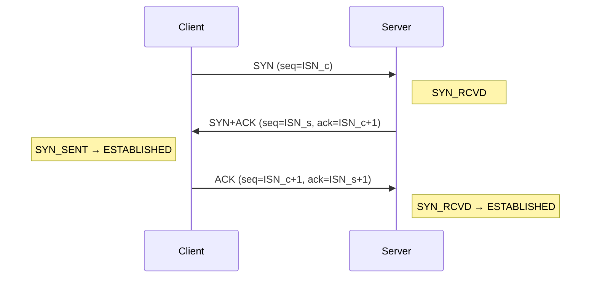

# 说说 TCP 的三次握手？

**难度**：简单

**创建时间**：2025-10-06 05:59:27

## 答案
TCP（传输控制协议）的三次握手（Three-Way Handshake）是建立可靠网络连接的核心机制，用于在客户端和服务器之间同步初始序列号（ISN）、确认通信能力并确保双方具备收发数据的能力。以下是详细解析：

---

### **1. 三次握手的核心目的**
- **同步序列号**：双方交换初始序列号（ISN），为后续数据分段和重组提供基准。
- **确认通信能力**：验证客户端和服务器均具备发送和接收数据的能力。
- **避免历史连接干扰**：防止旧的重复连接请求（如网络延迟导致的旧SYN包）干扰新连接。

---

### **2. 三次握手的详细流程**
#### **第一次握手：客户端 → 服务器（SYN）**
- **客户端动作**：
  - 生成一个随机初始序列号（`ISN_c`，例如 `1000`）。
  - 发送 `SYN` 包（标志位 `SYN=1`，序列号 `seq=ISN_c`）。
  - 客户端进入 `SYN_SENT` 状态。
- **服务器感知**：
  - 服务器收到 `SYN` 包后，知道客户端要建立连接，且能接收自己的响应。

#### **第二次握手：服务器 → 客户端（SYN + ACK）**
- **服务器动作**：
  - 生成自己的随机初始序列号（`ISN_s`，例如 `2000`）。
  - 发送 `SYN+ACK` 包（标志位 `SYN=1`、`ACK=1`，序列号 `seq=ISN_s`，确认号 `ack=ISN_c+1`）。
  - 服务器进入 `SYN_RCVD` 状态。
- **客户端感知**：
  - 客户端收到 `SYN+ACK` 后，确认服务器能接收自己的数据，且能发送数据。

#### **第三次握手：客户端 → 服务器（ACK）**
- **客户端动作**：
  - 发送 `ACK` 包（标志位 `ACK=1`，序列号 `seq=ISN_c+1`，确认号 `ack=ISN_s+1`）。
  - 客户端进入 `ESTABLISHED` 状态。
- **服务器动作**：
  - 服务器收到 `ACK` 后，确认客户端能接收自己的数据，进入 `ESTABLISHED` 状态。
- **连接建立**：
  - 双方完成序列号同步，可开始传输数据。

---

### **3. 关键字段解析**
| 字段       | 作用                                                                 |
|------------|----------------------------------------------------------------------|
| **SYN**    | 同步序列号（`SYN=1` 表示请求建立连接）。                             |
| **ACK**    | 确认号有效（`ACK=1` 表示确认号 `ack` 字段有意义）。                  |
| **seq**    | 序列号，标识数据分段的起始字节（初始为 `ISN`，后续按字节数递增）。   |
| **ack**    | 确认号，表示期望接收的下一个序列号（`ack = 对方seq + 1`）。          |

---

### **4. 为什么需要三次握手？**
#### **原因 1：防止历史连接干扰**
- **场景**：若网络延迟导致旧的 `SYN` 包到达服务器，服务器可能误认为是新连接请求。
- **三次握手的作用**：
  - 客户端通过第三次 `ACK` 确认当前连接是有效的，服务器收到后才会建立连接。
  - 旧的 `SYN` 包因无法收到对应的 `ACK` 而被丢弃。

#### **原因 2：双向通信能力验证**
- **两次握手的缺陷**：
  - 仅能验证客户端能发、服务器能收，但无法验证服务器能发、客户端能收。
  - 可能导致服务器资源浪费（如服务器发送数据后，客户端无法接收）。
- **三次握手的优势**：
  - 通过第二次和第三次握手，双向验证通信能力。

#### **原因 3：序列号同步**
- 双方需交换初始序列号（ISN），确保数据分段和重组的正确性。
- 三次握手是交换 ISN 的最小次数。

---

### **5. 状态转换图**

---

### **6. 常见问题**
#### **Q1：为什么不是两次或四次？**
- **两次握手**：无法验证服务器到客户端的通信能力，可能导致半开放连接。
- **四次握手**：冗余，第三次握手已能完成双向验证。

#### **Q2：ISN 的作用是什么？**
- 避免序列号重复（如长时间运行后序列号回绕）。
- 防止历史连接的数据被错误接收（通过随机化 ISN）。

#### **Q3：如果第三次 ACK 丢失怎么办？**
- 服务器未收到 `ACK` 会重传 `SYN+ACK`（超时重传机制）。
- 客户端收到重复 `SYN+ACK` 会重新发送 `ACK`。

#### **Q4：TCP 连接是全双工的吗？**
- 是的，三次握手后双方可同时发送和接收数据。

---

### **7. 实际应用中的优化**
- **TCP Fast Open（TFO）**：允许在第一次握手时发送数据（需客户端和服务器支持），减少延迟。
- **SYN Cookie**：服务器在资源紧张时，不分配资源直接生成 `SYN+ACK`，防止 SYN Flood 攻击。

---

### **总结**
TCP 的三次握手通过 **SYN → SYN+ACK → ACK** 的交互，实现了可靠的连接建立，核心价值在于：
1. **双向通信验证**：确保双方能发能收。
2. **序列号同步**：为数据传输提供基准。
3. **历史连接隔离**：避免旧请求干扰新连接。

理解三次握手是掌握 TCP 可靠性机制的基础，也是排查网络问题（如连接超时、半开放连接）的关键。
